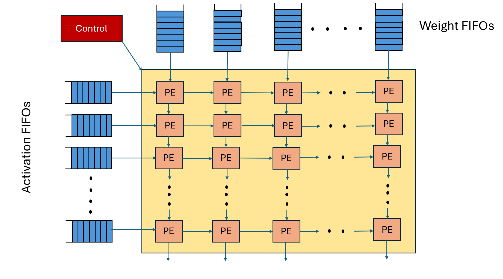
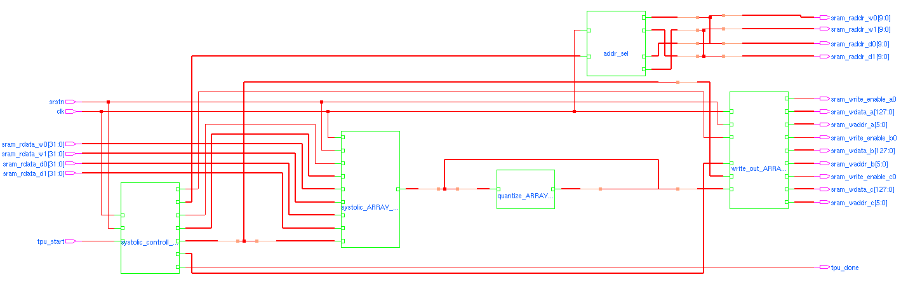
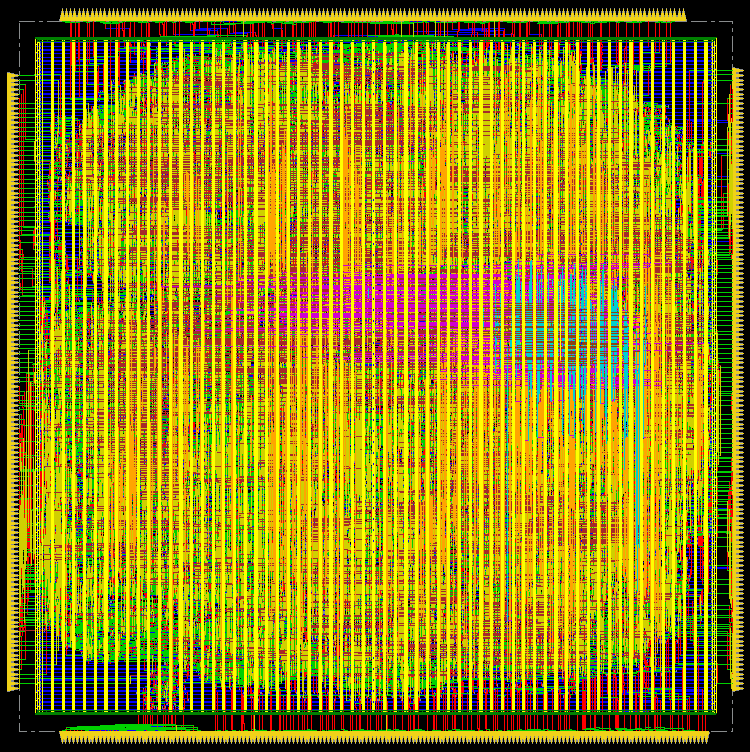

# Design and Implementation of 8x8 Systolic Array

## Abstract
This project implements an 8x8 systolic array for high-performance matrix multiplication, leveraging a parallel processing architecture optimized for efficiency and scalability. The workflow spans RTL design, synthesis (using **Cadence 45nm Library**), equivalence checking, physical implementation, and gate-level simulation using industry-standard EDA tools. The final output includes GDSII files for tape-out and validation reports.

---

## Table of Contents
1. [Introduction](#introduction)
2. [Systolic Array RTL to GDS Flow](#systolic-array-rtl-to-gds-flow)
3. [Prerequisite Tools](#prerequisite-tools)
4. [Getting Started](#getting-started)
5. [Contributors](#contributors)

---

## Introduction
The systolic array architecture is a powerful and scalable structure designed to accelerate matrix operations such as matrix multiplication, a key computation in many fields like machine learning and signal processing. In this project, we implement an 8×8 systolic array consisting of 64 processing elements (PEs) arranged in a regular 2D mesh.

Each PE is responsible for performing multiply-accumulate (MAC) operations, receiving inputs from activation FIFOs (First-In-First-Out buffers) and weight FIFOs at the array's boundaries. A centralized control unit manages the flow of data into the FIFOs and orchestrates the overall operation. As data moves rhythmically across the array horizontally and vertically, each PE computes partial results and passes intermediate values to its neighboring PEs.

This project covers the complete digital design flow for the 8×8 systolic array, from RTL development and pre-synthesis simulation to synthesis, formal equivalence checking, place-and-route (PnR), and gate-level simulations, enabling a full ASIC implementation.


*Fig 1. Architecture of 8x8 systolic array.*

---

## Systolic Array RTL to GDS Flow

### 1. RTL Design
- **Location**: `RTL/`
- **Details**: Verilog RTL code for the 8x8 systolic array and processing element (PE) modules.

### 2. Pre-Synthesis Simulation
- **Location**: `Pre-Synthesis_Simulation/`
- **Tools**: Xilinx Vivado for functional verification.
- **Steps**: Testbenches validate the systolic array's functionality before synthesis.

### 3. Synthesis
- **Location**: `Synthesis/`
- **Tools**: Cadence Genus with **Cadence 45nm Library** (command: `genus -f syn.tcl`).
- **Outputs**: Netlist, timing/power/area reports in `Synthesis/output/`.

### 4. Equivalence Checking
- **Location**: `Equivalence_Checking/`
- **Tools**: Cadence Conformal (command: `lec -XL -nogui -color -64 -dofile systolic.do`).
- **Purpose**: Ensures post-synthesis netlist matches RTL functionality.

### 5. Physical Design (PnR)
- **Location**: `PNR/`
- **Tools**: Cadence Innovus with **Cadence 45nm Library** (run using `source runPnR.tcl` in Innovus).
- **Steps**: Floorplanning, placement, clock tree synthesis, routing, and GDSII generation.

### 6. Gate-Level Simulation (GLS)
- **Location**: `Gate-Level-Simulation/`
- **Purpose**: Validates post-PnR netlist with timing annotations.

---

## Prerequisite Tools
The following tools and libraries are required to reproduce this workflow:
1. **Cadence EDA Tools**:
   - **Genus 21.1** (Logic Synthesis)
   - **Innovus 21.1** (Physical Design & Routing)
   - **Conformal 24.10** (Equivalence Checking)
2. **Xilinx Vivado** (Pre-Synthesis Simulation)
3. **Cadence 45nm PDK Library Files**:
   - Standard cell libraries, technology files, and parasitic extraction models.

---

## Getting Started
1. **Clone the repository**:
    ```bash
    git clone https://github.com/vishalkevat007/Design-and-Implementation-of-8x8-Systolic-Array.git
2. **Synthesis**:
    - Synthesis is performed using Cadence Genus.

    - To run synthesis:
        ```bash
        cd Synthesis/
        genus -f syn.tcl

    - Post-Synthesis Schematic:  
      
    *Fig 2. Schematic of the 8x8 systolic array generated after synthesis.*
    - The generated netlists and synthesis reports are located in the Synthesis/output/ directory.

3. **Equivalence Check**:
    - Formal equivalence checking between the RTL and the synthesized netlist is done using Cadence Conformal.

    - To run equivalence checking:
        ```bash
        cd Equivalence_Checking/
        lec -XL -nogui -color -64 -dofile systolic.do

4. **Floorplanning and Routing (PnR)**:
    - Floorplanning, placement, clock tree synthesis, and routing are performed using Cadence Innovus.

    - To execute the PnR flow:
        ```bash
        innovus -stylus
        source runPnR.tcl
    - Physical Layout:
    
    *Fig 2. Physical Layout of the design.*
    - Final GDSII, timing reports, and layout files are available inside the PNR/ directory.


## Contributors
- [Vishal Kevat](https://github.com/vishalkevat007)  
- [Jagdish Kurdiya](https://github.com/vishalkevat007)
- [Niharika Tulugu](https://github.com/vishalkevat007)    
